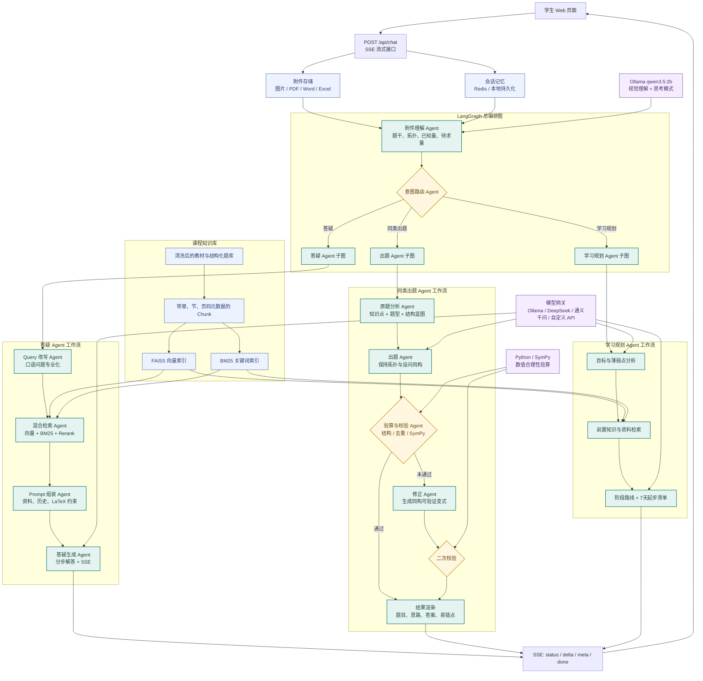

# CircuitMind LangGraph 多智能体工作流

本文档对应当前学生端的实际 LangGraph 编排。总图先完成附件理解和大模型意图路由，再进入答疑、同类出题或学习规划子图。

## 关键状态流转

LangGraph 状态中主要保存以下信息：

- `message`、`history`、`knowledge_base`：学生输入、最近对话和当前知识库。
- `attachment_context`、`attachment_blueprint`：附件识别文本以及电路拓扑、已知量、待求量蓝图。
- `intent`：路由结果，取值为 `answer`、`quiz` 或 `plan`。
- `rewritten_query`、`hits`：专业化检索问题和混合检索结果。
- `knowledge_point`、`quiz_type`、`quiz_family`：出题知识点、数值/概念题型和同构题家族。
- `draft`、`verification`：生成题草稿以及结构、去重和 SymPy 校验结果。
- `plan_profile`：学习目标、知识点、当前水平、时间范围与约束。
- `response`、`sources`：最终回复和可追溯资料来源。
