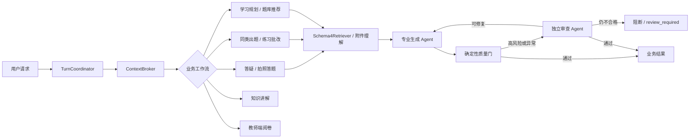

# CircuitMind 教学多智能体 V2

本文档描述当前产品内部的教学多智能体编排。V2 的原则是：语义判断交给单一职责 Agent，检索、Schema 校验、SymPy、分数加总等确定性工作保留为工具或质量门；生成和验收使用彼此独立的调用上下文。

> 范围说明：Schema 4 知识库构建不在本次重构范围内。教师端作业/题库提取和知识点标注也保持原实现不变；教师端只迁移学生作业批改和独立审查。

```mermaid
flowchart LR
    U[用户请求] --> C[TurnCoordinator]
    C --> B[ContextBroker]
    B --> F{业务工作流}

    F --> QA[答疑 / 拍照答题]
    F --> EX[同类出题 / 练习批改]
    F --> LP[学习规划 / 题库推荐]
    F --> KE[知识讲解]
    F --> TG[教师端阅卷]

    QA --> T[Schema4Retriever / 附件理解]
    EX --> T
    LP --> T
    T --> G[专业生成 Agent]
    G --> D[确定性质量门]
    D -->|高风险或异常| A[独立审查 Agent]
    A -->|可修复| G
    A -->|仍不合格| X[阻断 / review_required]
    D -->|通过| O[业务结果]
    A -->|通过| O
```

## 控制层

- `TurnEnvelope` 是服务器权威的回合契约，绑定 `run_id`、功能、知识库、目标焦点、附件角色和服务模型策略。
- `ContextBroker` 按 Agent 白名单和 token 预算生成独立上下文切片。会话历史只用于指代消解，附件、参考答案、评分标准、草稿和审查报告按职责隔离。
- `Schema4Retriever` 是确定性工具，返回图谱实体与关系、原子陈述、公式知识、图片/表格总结和 Paddle 证据，不包装成 LLM Agent。
- `QualityGate` 执行结构、证据 ID、LaTeX、SymPy、分数加总和答案泄漏检查。
- `RunAudit` 与 `AgentArtifact` 写入 `data/agent_runs/`，采用原子替换；只保存结构化结果摘要和质量状态，不保存思维链或完整提示词。

服务角色固定使用服务器端 `qwen3.7-flash`、temperature 0、关闭 thinking。学生选择的文本模型只用于最终答疑正文、同类题正文、学习计划正文和知识讲解单页正文。`qwen-image` 仅负责图片生成。

## 学生端工作流

### 答疑与拍照答题

1. `TurnCoordinator` 判定操作、题目范围和附件角色，不回答课程问题。
2. 有新图片时，`VisionInterpreter` 只转写题干、拓扑、已知量、待求量与不确定区域，不解题、不补条件。
3. Schema 4 检索器返回与问题有关的课程结构化内容。
4. `CourseAnswerer` 生成学生可见回答。课程特定结论在内部通过检索结果和 evidence ID 追踪，前端不展示“资料几”。
5. 图片题、计算题、参考答案解释、低置信度或冲突结果交给 `AnswerAuditor` 独立复核。失败时生成 Agent 最多返工一次，再失败则返回信息不足/阻断结果。

### 同类出题

`ExerciseAnalyst` 先输出 `preserve / vary / requested_changes / reasoning_goal` 契约；`ExerciseAuthor` 只在契约允许范围内生成新题；确定性结构检查和 SymPy 先验算，再由 `ExerciseAuditor` 独立重建拓扑、条件、答案和单位。仅允许一次返工，任何未通过独立复核的题目都不会发布，也不会被静默替换成另一道兜底题。

### 练习批改

`PracticeSubmissionReader` 只识别学生写出的内容；`PracticeGrader` 依据当前绑定题目和参考答案逐步评分；`PracticeGradeAuditor` 重新检查漏题、步骤、结论与分数一致性。审查失败后只返工一次，仍失败时不发布分数。

### 学习规划与题库推荐

- `LearnerProfiler` 形成学习目标、基础、薄弱点和约束；`PlanDesigner` 使用 Schema 4 章节结果生成路线；`PlanAuditor` 检查覆盖、顺序和可执行性。
- `RecommendationInterpreter` 形成训练目标；`RecommendationReranker` 只能阅读服务器召回的真实题干并从候选 ID 中选择，不生成不存在的题目。无完整选择依据时回退到确定性语义排序，不强行伪造推荐理由。

### 知识讲解

规划、内容审查、单页审查、布局和生图提示词编译均使用固定的服务模型；学生选择的文本模型只撰写已经确认边界的单页正文。页面和阶段结果继续由现有任务存储按页保存，支持中断恢复。

## 教师端范围

- 作业/题库逐页提取、跨页合并、整卷复核：保持现有流程不变。
- 题库知识点标注和 Schema 4 实体对齐：保持现有流程不变。
- 学生作业批改：`RubricGrader` 与 `GradingAuditor` 使用两个独立的 `qwen3.7-flash` 调用。审查失败后原批改角色只返工一次；仍有漏题、小问缺失或分数冲突时状态为 `review_required`。

## 提示词与失败语义

角色模板位于 `backend/app/prompts/roles/`，注册表位于 `backend/app/agents/v2/prompt_registry.py`。每个模板具有角色、单一任务、权威顺序、注入防护、上下文白名单、输出约束和版本哈希。

失败处理遵循固定上限：格式错误可修复一次；语义或质量失败携带结构化审查报告返工一次；第二次仍失败即阻断或转人工。系统没有“连续失败后强制通过”的分支。SSE 只显示“理解题目、检索知识、生成结果、质量复核”等业务阶段，不暴露 Agent 私有提示词和推理。
