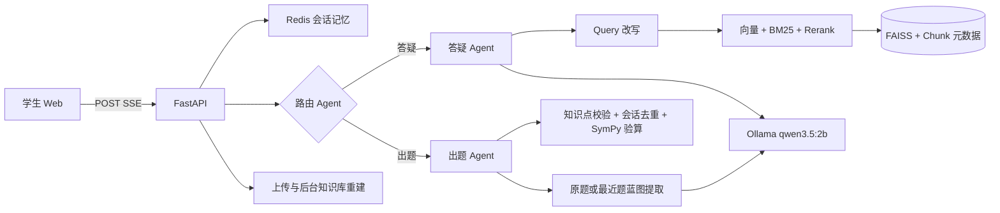

# CircuitMind 多智能体电路课程教学平台

这是一个本地优先的电路课程教学 MVP。当前已完成学生端；教师端保留页面、路由和 `/api/teacher/status` 接口，后续可直接扩展。

已跑通的链路：

- 默认使用本地 Ollama `qwen3.5:2b`；可切换其他已安装 Ollama 模型，或接入 DeepSeek、通义千问和自定义 OpenAI 兼容 API。私有思考字段不会返回前端。
- LangGraph 编排的路由 Agent、答疑 Agent、检索 Agent、出题 Agent 和 SymPy 验算 Agent；检索 Agent 仅服务答疑链路。
- 图片出题先提取“电路拓扑、已知量、特殊条件、待求量”蓝图；连续“再出一道”会沿用最近生成题，同类题不调用知识库检索并必须通过同构校验。
- 教材清洗、章节/段落语义切分、章/节/页码元数据、结构化题库、384 维向量化和 populated FAISS 索引。
- 向量语义检索 + BM25 关键词检索 + 规则重排。
- FastAPI、CORS、统一异常处理、日志、POST SSE 真正 token 流式输出、上传与后台重建知识库。
- Redis 最近 N 轮会话记忆；Redis 不可用时自动切换本地持久化记忆，服务重启后仍可执行出题去重。
- 学生交互栏支持题目图片和 PDF/Word/Excel/Markdown 等附件；`qwen3.5:2b` 直接完成图片题干识别。
- React + TypeScript + Ant Design + Zustand + KaTeX 学生端，含 LaTeX 定界符容错预处理。
- 右上角模型选择器动态读取本机 Ollama 模型；所选模型与云端 API 配置会保存在当前浏览器，也可通过后端环境变量配置。
- 左侧“最近学习”读取持久化会话列表，支持点击恢复历史对话；刷新页面后会自动恢复当前会话。

## 当前数据成果

默认知识库先按 MVP 范围索引《模拟电子技术基础》第一章：

- 教材范围：PDF 第 25–94 页，共 69 个有效文本页。
- 示例题库：12 道题，包含题号、题目文本、知识点标签、标准答案、易错点、难度、题型、解题步骤。
- 向量库：95 个 Chunk，向量维度 384，状态 `populated`。
- 元数据：每个教材 Chunk 保留来源、章、节、PDF 页码和知识点标签。

主要产物位于：

```text
RAG_Resources/
  模拟电子技术基础-童诗白.pdf
  电路课程示例题库.xlsx
data/vector_stores/default/
  cleaned_documents/
  chunks.jsonl
  question_bank.json
  vectors.faiss
  index_meta.json
```

## 架构



## 直接启动

确保 Ollama 已运行且存在 `qwen3.5:2b`：

```powershell
ollama list
```

模型权重不会提交到 GitHub。首次运行先下载项目使用的嵌入模型：

```powershell
conda activate llm
python scripts/download_embedding_model.py
```

脚本只下载 `sentence-transformers/paraphrase-multilingual-MiniLM-L12-v2` 推理所需文件到
`models/paraphrase-multilingual-MiniLM-L12-v2`，不会读取或写入任何 API Key。

项目已经包含构建好的前端和默认向量库，因此只需在项目根目录运行：

```powershell
conda activate llm
python -m uvicorn backend.app.main:app --host 127.0.0.1 --port 8000
```

或：

```powershell
powershell -ExecutionPolicy Bypass -File scripts/start.ps1
```

打开 `http://127.0.0.1:8000/student`。生产构建由 FastAPI 直接提供；开发前端可在 `frontend` 中运行 `npm run dev`，Vite 会代理 `/api` 到 8000 端口。

## 模型切换与 API 配置

点击学生端右上角的模型名称即可选择：

- 本地 Ollama：自动显示 `ollama list` 中已经安装的模型。
- DeepSeek API：默认提供 `deepseek-v4-flash` 和 `deepseek-v4-pro`。
- 通义千问 API：默认提供 `qwen-plus`、`qwen-max` 和 `qwen-turbo`，Base URL 可按百炼工作空间修改。
- 自定义 API：填写任意兼容 OpenAI Chat Completions 的模型名称、API Key 和 Base URL。

页面输入的模型配置和 API Key 会写入当前浏览器的 `localStorage`，不会写入项目文件；配置弹窗提供清除已保存密钥的入口。公用电脑不建议保存云端密钥。也可以在 `.env` 配置 `DEEPSEEK_API_KEY`、`QWEN_API_KEY` 及对应 Base URL。使用云端多模态模型时，题目、最近对话、检索上下文和必要的电路图会发送到所选服务。

## 环境重建

所有 Python 操作均在现有 `llm` 环境中进行：

```powershell
conda activate llm
python -m pip install -r requirements.txt
python scripts/download_embedding_model.py
python scripts/build_knowledge_base.py --chapter-limit 1
cd frontend
npm install
npm run build
```

如果需要索引教材全部章节：

```powershell
conda activate llm
python scripts/build_knowledge_base.py --full
```

## Redis 会话记忆

若本机已有 Redis，服务会自动连接 `redis://127.0.0.1:6379/0`。也可以使用项目中的可选配置：

```powershell
docker compose up -d redis
```

没有 Redis 时会话会保存到本机 `data/session_memory`，服务重启后仍可恢复最近对话；`/api/health` 会显示 `local-persistent`。

## 新增教材或题库

学生端右侧点击“添加教材 / 新建知识库”即可：

1. 选择默认知识库，或输入英文标识创建独立知识库。
2. 上传 PDF、Word、Markdown、文本、Excel 或 JSON。
3. 后端把当前选中的模型配置仅传给本次后台任务，执行语义清洗、版面解析、电路图理解、Chunking、Embedding 和索引重载；API Key 不写入知识库产物。
4. `/api/kb/status` 返回 `building`、`ready` 或 `error`。

已有资料无需重新上传：在同一弹窗点击“使用当前模型重新构建已有资料”即可启动 v2 多模态重建。

Excel 题库至少需要以下列：`题号`、`题目文本`、`知识点标签`、`标准答案`、`易错点`。其余支持列为 `难度`、`题型`、`解题步骤`。

学生交互栏的回形针按钮可上传题目图片或文档附件。图片会由当前选择且支持视觉输入的模型识别题干、参数、连接关系和知识点，再进入答疑或同类出题工作流；选择远程模型时图片会发送到对应 API。

## 多模态图文知识库（v2）

新版建库同时产出以下可审计数据：

- `cleaning_audit.json`：DeepSeek/规则对每页的保留或丢弃决定及原因，原 PDF 永不物理修改。
- `multimodal_elements.jsonl`：文本、公式、表格、图片、电路图的页码、bbox、阅读顺序、原图路径和内容哈希。
- `artifacts/`：从 PDF 提取的原始图片。
- `knowledge_graph.json`：Chunk—概念—电路元件关系；配置 Neo4j 后会同步到图数据库。
- `qdrant/`：Linux/macOS 未配置 `QDRANT_URL` 时可使用 Qdrant 嵌入式持久化；同时保留 `vectors.faiss` 兼容回退。

完整处理顺序为：语义清洗 → PDF-Extract-Kit 结构结果（若已配置）/PyMuPDF 可审计降级 → SINA 电路识别（若已配置）/多模态模型与 OpenCV 降级 → Netlist/描述融合 → 文本与可选 CLIP 图片向量 → Qdrant + BM25 + 本地图谱/Neo4j → 融合重排。检索命中的电路图会和结构化描述一起交给答疑模型。

PDF-Extract-Kit 和 SINA 依赖较重，建议部署成独立 GPU worker，不要安装到 FastAPI 环境：

1. PDF worker 将每本书结果导出为 `<PDF文件名不含扩展名>.json`，在 `.env` 设置 `PDF_EXTRACT_KIT_OUTPUT_DIR`。系统兼容 `elements` 或 `content_list` 列表，并读取 `page/page_idx`、`type/category`、`bbox`、`text/content`。
2. SINA worker 暴露 `POST multipart/form-data`，字段名为 `image`，返回 `components`、`nets`、`netlist`、`description` 和 `confidence`，在 `.env` 设置 `SINA_ENDPOINT`。
3. 设置本地 `CLIP_MODEL_PATH` 后建立独立图片向量集合；设置 `RERANK_MODEL_PATH` 后启用 CrossEncoder 重排。未配置时图片的 VLM 结构描述仍可被文本向量检索。

Qdrant 和 Neo4j 可用 Docker 启动：

```powershell
docker compose up -d qdrant neo4j
```

随后设置 `QDRANT_URL=http://127.0.0.1:6333`、`NEO4J_URI=bolt://127.0.0.1:7687` 和 Neo4j 密码。若只做本机小规模验证，可不启动它们：Linux/macOS 使用 Qdrant 嵌入式模式，图检索使用 `knowledge_graph.json`；Windows 为避免嵌入式 Qdrant 与 Torch/FAISS 的本地运行库冲突，默认直接使用同一批向量的 FAISS 兼容索引，配置 Qdrant 服务地址后自动切换为 Qdrant 在线查询。

## 核心 API

### `POST /api/chat`

```json
{
  "session_id": "student-demo",
  "message": "PN结为什么具有单向导电性？",
  "mode": "auto",
  "knowledge_base": "default",
  "attachment_ids": [],
  "model_provider": "ollama",
  "model": "qwen3.5:2b",
  "api_key": "",
  "base_url": "http://127.0.0.1:11434"
}
```

返回 SSE 事件：`connected`、`status`、`delta`、`meta`、`done`；错误为 `error`。答疑 Agent 的 `delta` 是 Ollama 实时 token，模型思维链不会传输。

### `POST /api/attachments`

`multipart/form-data` 字段为 `file` 与 `session_id`。接口返回附件 ID，将其放入 `/api/chat` 的 `attachment_ids` 即可让 Agent 读取；支持 PNG/JPEG/WebP/BMP、PDF、DOCX、XLSX、TXT、Markdown 和 JSON。

### `POST /api/upload`

`multipart/form-data` 字段：

- `file`：上传文件。
- `knowledge_base`：默认 `default`。
- `rebuild`：默认 `true`。
- `model_provider`、`model`、`api_key`、`base_url`：本次多模态建库使用的模型配置；网页会自动提交当前选择。

### 其他

- `GET /api/health`
- `GET /api/models`
- `GET /api/sessions`
- `GET /api/sessions/{session_id}`
- `DELETE /api/sessions/{session_id}`（同时删除该会话的附件）
- `GET /api/kb/status`
- `POST /api/kb/rebuild`（使用当前模型配置重建已有资料）
- `GET /api/teacher/status`

## 测试与诊断

```powershell
conda activate llm
python -m pytest -q
python scripts/retrieval_smoke_test.py
python scripts/ollama_smoke_test.py
```

后端日志写入 `logs/backend.log`。
