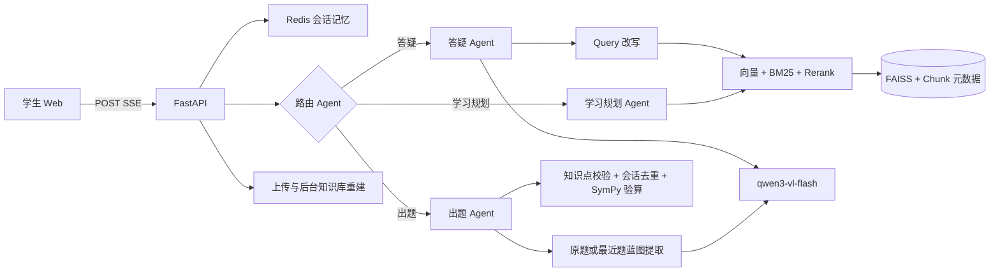

# CircuitMind 多智能体电路课程教学平台

这是一个本地优先的电路课程教学 MVP。当前已完成学生端；教师端保留页面、路由和 `/api/teacher/status` 接口，后续可直接扩展。

已跑通的链路：

- 学生端对话答题及图片/文档附件识别固定使用 `qwen3-vl-flash`；私有思考字段不会返回前端。
- LangGraph 编排的大模型路由 Agent、答疑 Agent、检索 Agent、出题 Agent、学习规划 Agent 和 SymPy 验算 Agent；学习规划会结合知识库资料生成可执行路线。
- 图片出题先提取“电路拓扑、已知量、特殊条件、待求量”蓝图；连续“再出一道”会沿用最近生成题，同类题不调用知识库检索并必须通过同构校验。
- 教材清洗、章节/段落语义切分、章/节/原始页码元数据、384 维向量化和 populated FAISS/Qdrant 索引；Excel/JSON 题库与课程知识库严格隔离。
- 向量语义检索 + BM25 关键词检索 + 规则重排。
- FastAPI、CORS、统一异常处理、日志、POST SSE 真正 token 流式输出、上传与后台重建知识库。
- Redis 最近 N 轮会话记忆；Redis 不可用时自动切换本地持久化记忆，服务重启后仍可执行出题去重。
- 学生交互栏支持题目图片和 PDF/Word/Excel/Markdown 等附件；PDF 页面和 Office 内嵌图片会交给 `qwen3-vl-flash` 识别公式、电路图与题干。
- React + TypeScript + Ant Design + Zustand + KaTeX 学生端，含 LaTeX 定界符容错预处理。
- 右上角可配置通义千问 API Key 与 Base URL；配置会保存在当前浏览器，也可通过后端环境变量提供。
- 左侧“最近学习”读取持久化会话列表，支持点击恢复历史对话；刷新页面后会自动恢复当前会话。
- 学生端知识图谱默认展示聚合后的“教材—页面—知识点—电路图—去重元件”语义关系；公式、文本片段和网络节点保留在底层图中作为检索证据，不直接铺到画布上。
- 答疑和出题内容均可加入持久化错题本；归档前自动提取知识点，错题页可按薄弱点发起知识补全与巩固规划。

## 当前数据成果

默认知识库先按 MVP 范围索引《模拟电子技术基础》第一章：

- 教材范围：PDF 第 25–94 页，共 69 个有效文本页。
- 示例题库文件仍作为独立资源保留，但不会进入课程知识库、知识图谱或检索。
- 向量库：83 个纯教材 Chunk，向量维度 384，题库 Chunk 为 0，状态 `populated`。
- 元数据：每个教材 Chunk 保留来源、章、节、PDF 页码和知识点标签。

主要产物位于：

```text
RAG_Resources/
  模拟电子技术基础-童诗白.pdf
  电路课程示例题库.xlsx  # 独立题库，不参与知识库构建
data/vector_stores/default/
  cleaned_documents/
  chunks.jsonl
  question_bank.json      # 隔离审计占位，不含题目
  vectors.faiss
  index_meta.json
```

## 架构



## 直接启动

若使用本地模型，可启动 Ollama 并确认存在可用模型：

```powershell
ollama list
```

Ollama 未启动不会阻止程序启动；可以先在页面配置云端 API，后续启动 Ollama 后重新打开模型弹窗即可选择刚发现的本地模型。

模型权重不会提交到 GitHub。首次运行先下载项目使用的嵌入模型：

```powershell
conda activate llm
python scripts/download_embedding_model.py
```

脚本只下载 `sentence-transformers/paraphrase-multilingual-MiniLM-L12-v2` 推理所需文件到
`models/paraphrase-multilingual-MiniLM-L12-v2`，不会读取或写入任何 API Key。

项目已经包含构建好的前端和默认向量库，因此只需在项目根目录运行：

```powershell
conda activate llm
python -m uvicorn backend.app.main:app --host 127.0.0.1 --port 8000
```

或：

```powershell
powershell -ExecutionPolicy Bypass -File scripts/start.ps1
```

打开 `http://127.0.0.1:8000/student`。生产构建由 FastAPI 直接提供；开发前端可在 `frontend` 中运行 `npm run dev`，Vite 会代理 `/api` 到 8000 端口。

## 模型与 API 配置

学生端统一使用 `qwen3-vl-flash` 完成：

- 普通文本问答、分步解题和学习规划。
- PNG/JPEG/WebP/BMP 图片附件识别。
- PDF 页面视觉识别，以及 DOCX/XLSX 中内嵌图片的识别；文档提取出的正文也会一并进入回答上下文。
- 知识库上传或重建时的多模态分析。

页面输入的 API Key 会写入当前浏览器的 `localStorage`，不会写入项目文件；配置弹窗提供清除入口。公用电脑不建议保存云端密钥。也可以在 `.env` 配置 `QWEN_API_KEY` 和 `QWEN_BASE_URL`。题目、最近对话、检索上下文及附件视觉内容会发送到通义千问 API。

## 环境重建

所有 Python 操作均在现有 `llm` 环境中进行：

```powershell
conda activate llm
python -m pip install -r requirements.txt
python scripts/download_embedding_model.py
python scripts/build_knowledge_base.py --chapter-limit 1
cd frontend
npm install
npm run build
```

如果需要索引教材全部章节：

```powershell
conda activate llm
python scripts/build_knowledge_base.py --full
```

## Redis 会话记忆

若本机已有 Redis，服务会自动连接 `redis://127.0.0.1:6379/0`。也可以使用项目中的可选配置：

```powershell
docker compose up -d redis
```

没有 Redis 时会话会保存到本机 `data/session_memory`，服务重启后仍可恢复最近对话；`/api/health` 会显示 `local-persistent`。

## 新增教材或题库

学生端右侧点击“添加教材 / 新建知识库”即可：

1. 先选择首份 PDF、Word、Markdown 或文本资料。
2. 输入新知识库的英文标识，再点击“确认建立知识库”。
3. 后端使用 `qwen3-vl-flash` 执行语义清洗、版面解析、电路图理解、Chunking、Embedding 和索引重载；API Key 不写入知识库产物。
4. `/api/kb/status` 返回 `building`、`ready` 或 `error`；Windows 下的短暂进度文件占用会自动重试，不会中断实际构建。

默认知识库、当前目标知识库和追加资料仍在同一弹窗的“管理已有知识库”区域维护。已有资料无需重新上传：点击“使用 qwen3-vl-flash 重新构建已有资料”即可启动 v2 多模态重建。

Excel/JSON 题库不会进入 RAG 知识库，也不会参与检索或图谱构建。出题 Agent 只依据学生原题和会话历史生成同构变式。

学生交互栏的回形针按钮可上传题目图片或文档附件。图片、PDF 页面及 Office 内嵌图片会由 `qwen3-vl-flash` 识别题干、公式、参数、连接关系和知识点，再进入答疑或同类出题工作流。每轮最多发送 `MAX_CHAT_DOCUMENT_IMAGES`（默认 6）张由文档产生的视觉页面或内嵌图片。

## 分层多模态图文知识库（v2.1）

新版建库同时产出以下可审计数据：

- `cleaning_audit.json`：`qwen3-vl-flash`/规则对每页的保留或丢弃决定及原因，原 PDF 永不物理修改。
- `multimodal_elements.jsonl`：文本、公式、表格、图片、电路图的页码、bbox、阅读顺序、原图路径和内容哈希。
- `artifacts/`：从 PDF 提取的原始图片。
- `knowledge_graph.json`：教材—原始页码—Chunk—课程概念—电路元件—网络关系；配置 Neo4j 后会同步到图数据库。
- `pipeline_audit.json`：清洗、解析、模态处理、融合、检索和应用六层状态与数量审计。
- `qdrant/`：Linux/macOS 未配置 `QDRANT_URL` 时可使用 Qdrant 嵌入式持久化；同时保留 `vectors.faiss` 兼容回退。

完整处理顺序为：大模型语义清洗（带技术内容安全保留）→ PDF-Extract-Kit Layout/MFD 结构解析 → 文本 NLP → 独立公式筛选、原生 PDF 字形/坐标恢复 LaTeX（扫描件使用 `qwen3-vl-flash` 回退）→ `qwen3-vl-flash` 电路图识别 → 元件/网络/Netlist/描述融合 → 文本与多模态向量 → Qdrant/FAISS + BM25 + Neo4j/本地图 → 融合重排。行内数学符号保留在正文，不会各自生成公式 Chunk；构建结束会强制校验 Chunk/向量数量、图边完整性、bbox 与题库隔离，校验失败的暂存索引不会被激活。

PDF-Extract-Kit 使用本地 GPU 与官方权重，Qwen3-VL 使用百炼 API：

1. 在 `.env` 设置 `PDF_EXTRACT_KIT_DIR=third_party/PDF-Extract-Kit`；小样联调可用 `PDF_EXTRACT_KIT_PAGE_LIMIT=3`限制页数。
2. 设置 `QWEN_CIRCUIT_VISION_MODEL=qwen3-vl-flash` 和 `QWEN_MULTIMODAL_EMBEDDING_MODEL=qwen3-vl-embedding`；电路图由 Flash 识别，图片与文本向量默认为 1024 维。
3. 设置 `RERANK_MODEL_PATH` 可额外启用 CrossEncoder 重排；未配置时仍使用向量、BM25、图关系和图片相似度融合。

Qdrant 和 Neo4j 可用 Docker 启动：

```powershell
docker compose up -d qdrant redis
```

本机 Neo4j Windows Server 可用 `powershell -File scripts/neo4j_server.ps1 -Action start` 管理；也可选择 `docker compose up -d neo4j`。随后设置 `QDRANT_URL=http://127.0.0.1:6333`、`NEO4J_URI=bolt://127.0.0.1:7687`、`NEO4J_HTTP_URL=http://127.0.0.1:7474` 和 Neo4j 密码。Windows 检索侧通过 Qdrant/Neo4j REST API 查询，避免其 Python 客户端与 Torch/FAISS 本地运行库冲突。

## 核心 API

### `POST /api/chat`

```json
{
  "session_id": "student-demo",
  "message": "PN结为什么具有单向导电性？",
  "mode": "auto",
  "knowledge_base": "default",
  "attachment_ids": [],
  "model_provider": "qwen",
  "model": "qwen3-vl-flash",
  "api_key": "",
  "base_url": "https://dashscope.aliyuncs.com/compatible-mode/v1"
}
```

返回 SSE 事件：`connected`、`status`、`delta`、`meta`、`done`；错误为 `error`。答疑 Agent 通过 `qwen3-vl-flash` 实时返回 token，模型思维链不会传输。为兼容旧客户端，请求仍接受模型字段，但学生对话会固定路由到 `qwen3-vl-flash`。

### `POST /api/attachments`

`multipart/form-data` 字段为 `file` 与 `session_id`。接口返回附件 ID，将其放入 `/api/chat` 的 `attachment_ids` 即可让 Agent 读取；支持 PNG/JPEG/WebP/BMP、PDF、DOCX、XLSX、TXT、Markdown 和 JSON。

### `POST /api/upload`

`multipart/form-data` 字段：

- `file`：上传文件。
- `knowledge_base`：默认 `default`。
- `rebuild`：默认 `true`。
- `model_provider`、`model`、`api_key`、`base_url`：本次多模态建库使用的模型配置；网页会自动提交当前选择。

### 其他

- `GET /api/health`
- `GET /api/models`
- `GET /api/sessions`
- `GET /api/sessions/{session_id}`
- `DELETE /api/sessions/{session_id}`（同时删除该会话的附件）
- `GET /api/kb/status`
- `GET /api/kb/{knowledge_base}/graph`
- `POST /api/kb/rebuild`（使用 `qwen3-vl-flash` 重建已有资料）
- `GET /api/mistakes?student_id=...`
- `POST /api/mistakes`（调用当前模型提取知识点后归档）
- `DELETE /api/mistakes/{mistake_id}?student_id=...`
- `GET /api/teacher/status`

## 测试与诊断

```powershell
conda activate llm
python -m pytest -q
python scripts/retrieval_smoke_test.py
python scripts/ollama_smoke_test.py
```

后端日志写入 `logs/backend.log`。
