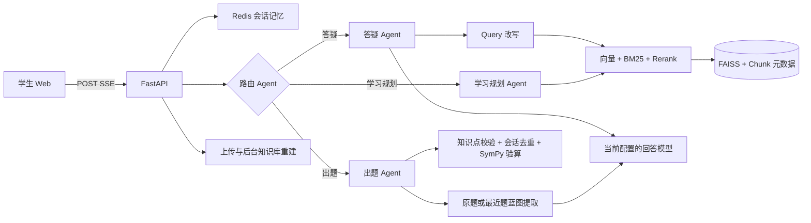

# CircuitMind 多智能体电路课程教学平台

这是一个本地优先的电路课程教学 MVP。当前已完成学生学习工作台与教师作业工作台；当前版本按单教师、单学生流程运行，班级与学生管理暂不在范围内。

已跑通的链路：

- 学生端对话答题及图片/文档附件识别使用页面当前配置的模型；私有思考字段不会返回前端。
- LangGraph 编排的大模型路由 Agent、答疑 Agent、检索 Agent、出题 Agent、学习规划 Agent 和 SymPy 验算 Agent；学习规划会结合知识库资料生成可执行路线。
- 图片出题先提取“电路拓扑、已知量、特殊条件、待求量”蓝图；连续“再出一道”会沿用最近生成题，同类题不调用知识库检索并必须通过同构校验。
- 教材清洗、章节/段落语义切分、章/节/原始页码元数据、384 维向量化和 populated FAISS/Qdrant 索引；Excel/JSON 题库与课程知识库严格隔离。
- 向量语义检索 + BM25 关键词检索 + 规则重排。
- FastAPI、CORS、统一异常处理、日志、POST SSE 真正 token 流式输出、上传与后台重建知识库。
- Redis 最近 N 轮会话记忆；Redis 不可用时自动切换本地持久化记忆，服务重启后仍可执行出题去重。
- 学生交互栏支持题目图片和 PDF/Word/Excel/Markdown 等附件；PDF 页面和 Office 内嵌图片会交给当前配置且支持视觉输入的模型识别公式、电路图与题干。
- React + TypeScript + Ant Design + Zustand + KaTeX 学生端，含 LaTeX 定界符容错预处理。
- 右上角可切换本地 Ollama、DeepSeek、通义千问或自定义兼容 API；配置会保存在当前浏览器，也可通过后端环境变量提供。
- 左侧“最近学习”读取持久化会话列表，支持点击恢复历史对话；刷新页面后会自动恢复当前会话。
- 学生端知识图谱默认展示聚合后的“教材—页面—知识点—电路图—去重元件”语义关系；公式、文本片段和网络节点保留在底层图中作为检索证据，不直接铺到画布上。
- 答疑、AI 出题和外部题库内容均可加入持久化错题本；支持来源追踪、分类、批注、知识图谱对齐、章节/前置知识定位和确定性薄弱点学习规划。实现、接口与迁移约定见 [错题本集成说明](docs/MISTAKE_BOOK.md)。
- 学生可从已完成的刷题批改中选择 `1..N` 道题生成持久化答案分析报告，查看逐步证据、跨题统计和历史版本，并通过打印视图保存为 PDF。数据口径与接口见 [学生答案分析报告](docs/ANSWER_REPORTS.md)。
- 教师可上传试卷、课后习题、学习指导书、图片或扫描版习题册；`qwen3-vl-flash` 联合 PDF-Extract-Kit 过滤目录、知识讲解等非题目内容，按题提取题号、共同题干、分层小问、选项、所属插图、参考答案与评分点，并重排为可打印的作业内容和参考答案。
- 学生端“我的作业”支持多张作答照片提交；`qwen3-vl-flash` 识别手写内容并评分，`qwen3-vl-8b-instruct` 独立复核漏题、错读、步骤分与总分，疑点会标记为教师复查。
- 学生交互栏新增“知识讲解”：文本模型先按具体问题动态规划 4–7 页大纲并逐页完成教学文案，再根据整组内容独立设计每页主视觉、区域占比与阅读动线，最后编译专属提示词交给 `qwen-image-2.0` 生成 16:9 中文信息图；前端展示实时进度、页面大纲、缩略图、大图预览、下载与最近记录。

## 当前数据成果

默认知识库先按 MVP 范围索引《模拟电子技术基础》第一章：

- 教材范围：PDF 第 25–94 页，共 69 个有效文本页。
- 示例题库文件仍作为独立资源保留，但不会进入课程知识库、知识图谱或检索。
- 向量库：83 个纯教材 Chunk，向量维度 384，题库 Chunk 为 0，状态 `populated`。
- 元数据：每个教材 Chunk 保留来源、章、节、PDF 页码和知识点标签。

主要产物位于：

```text
RAG_Resources/
  模拟电子技术基础-童诗白.pdf
  电路课程示例题库.xlsx  # 独立题库，不参与知识库构建
data/vector_stores/default/
  cleaned_documents/
  chunks.jsonl
  question_bank.json      # 隔离审计占位，不含题目
  vectors.faiss
  index_meta.json
```

## 架构


```mermaid
flowchart LR
  S[学生 Web] -->|POST SSE| API[FastAPI]
  API --> M[Redis 会话记忆]
  API --> R{路由 Agent}
  R -->|答疑| A[答疑 Agent]
  R -->|出题| Q[出题 Agent]
  R -->|学习规划| LP[学习规划 Agent]
  A --> W[Query 改写]
  Q --> K[原题或最近题蓝图提取]
  W --> H[向量 + BM25 + Rerank]
  H --> V[(FAISS + Chunk 元数据)]
  LP --> H
  A --> L[当前配置的回答模型]
  K --> L
  Q --> P[知识点校验 + 会话去重 + SymPy 验算]
  API --> U[上传与后台知识库重建]
```

## 直接启动

若使用本地模型，可启动 Ollama 并确认存在可用模型：

```powershell
ollama list
```

Ollama 未启动不会阻止程序启动；可以先在页面配置云端 API，后续启动 Ollama 后重新打开模型弹窗即可选择刚发现的本地模型。

模型权重不会提交到 GitHub。首次运行先下载项目使用的嵌入模型：

```powershell
conda activate llm
python scripts/download_embedding_model.py
```

脚本只下载 `Qwen/Qwen3-Embedding-0.6B` 推理所需文件到
`models/Qwen3-Embedding-0.6B`，不会读取或写入任何 API Key。查询会自动使用模型内置的
retrieval instruct，教材文档向量不添加 instruct。

项目包含默认向量库。启动方式取决于本地代码是否刚刚同步过他人的推送。

### 日常快速启动

如果本次没有执行 `git pull`，也没有合并或变基他人的推送，前端依赖和构建产物没有变化，可在项目根目录直接启动后端：

```powershell
conda activate llm
python -m uvicorn backend.app.main:app --host 127.0.0.1 --port 8000
```

这是日常使用的默认启动方式，会直接复用现有的 `frontend/dist`，无需重复安装前端依赖和构建页面。

### 拉取或合并他人推送后的首次启动

只有在执行 `git pull`，或通过 merge/rebase 合并了他人的推送后，才运行完整启动脚本：

```powershell
powershell -ExecutionPolicy Bypass -File scripts/start.ps1
```

完整脚本会先在 `frontend` 中执行锁定依赖安装（`npm ci --no-audit --no-fund`）和 `npm run build`，确保 FastAPI 提供的前端产物与同步后的源码一致，然后使用 `llm` 环境启动后端。构建或依赖安装失败时，脚本会停止而不会继续提供旧页面。本次完整启动完成后，后续未再同步他人推送时继续使用上面的日常快速启动命令。

打开 `http://127.0.0.1:8000/student`；教师作业工作台位于 `http://127.0.0.1:8000/teacher`。生产构建由 FastAPI 直接提供；开发前端可在 `frontend` 中运行 `npm run dev`，Vite 会代理 `/api` 到 8000 端口。

## 作业布置与双模型批改

教师端上传附件后会在后台执行以下流程：

1. PDF 页面渲染或图片标准化，PDF-Extract-Kit 给出版面区域候选。
2. `qwen3-vl-flash` 逐页过滤非题目内容，返回题型、题目标识、共同题干/分层小问/选项/插图/答案 bbox、参考答案和评分点；选择题缺项时会自动二次校对，跨页题干合并时会去除重复复述。
3. 系统保留大题层级、题号、题干换行、选项分栏和题图顺序，以结构化数据重新排版；题图单独裁取后插回对应题目，不再生成“截图 + 白块遮答案”的题面。
4. 教师预览后发布，学生端只取得不含 `answer`、`rubric` 和原始附件地址的数据。
5. 学生拍照提交后，`qwen3-vl-flash` 识别并逐题评分，再由 `qwen3-vl-8b-instruct` 独立复核；复核不通过的提交进入“待教师复查”。

需要在 `.env` 配置 `QWEN_API_KEY`。相关模型与限制可通过 `QWEN_HOMEWORK_EXTRACTION_MODEL`、`QWEN_HOMEWORK_GRADING_MODEL`、`QWEN_HOMEWORK_REVIEW_MODEL`、`MAX_HOMEWORK_UPLOAD_MB` 和 `MAX_HOMEWORK_ANSWER_IMAGES` 调整。作业及提交保存在 `data/homework/`。

## 模型切换与 API 配置

点击学生端右上角的模型名称可选择本地 Ollama、DeepSeek、通义千问或自定义 OpenAI 兼容 API。通义千问可分别选择 `qwen3.7-flash`、`qwen3.7-plus`、`qwen3.7-max` 文本模型和 `qwen3-vl-flash`、`qwen3-vl-plus` 视觉模型，两个模型共用一套 API Key 与 Base URL。选择其他文本提供商时，图片理解继续使用独立配置的 Qwen 视觉模型。

- 检索阶段可以临时调用文本或多模态 Embedding、BM25、知识图谱和重排器；这些专用模型只产生检索依据，不会替换当前回答模型。
- 页面模型配置只影响普通答疑、拍照答题、同类题生成、交互式批改和知识讲解文本生成。
- `qwen3-vl-embedding` 仅用于知识库多模态向量化，不会出现在交互模型列表中。
- 上传或重建知识库固定使用本地 PaddleOCR-VL 做页面、标题、公式和表格转写；`qwen3-vl-flash` 只总结与课程相关的图片和表格，不参与公式 OCR 或公式改写，并可按需调用 `qwen3-vl-embedding`。浏览器模型和 API Key 不会发送给建库任务。
- 题库建立、作业识别与批改继续使用 `QWEN_HOMEWORK_EXTRACTION_MODEL`、`QWEN_HOMEWORK_GRADING_MODEL` 和 `QWEN_HOMEWORK_REVIEW_MODEL`。

页面输入的模型配置和 API Key 会写入当前浏览器的 `localStorage`，不会写入项目文件；配置弹窗提供清除入口。公用电脑不建议保存云端密钥。也可以在 `.env` 配置对应服务的 API Key 和 Base URL。使用云端模型时，题目、最近对话、检索上下文及附件视觉内容会发送到所选 API。

### 知识讲解与 Qwen Image

知识讲解使用当前回答模型按用户问题自由规划整组内容，不预设“概念—原理—应用”等固定顺序。规划阶段先把用户明确要求的对象、关系、条件和分析视角拆成覆盖清单，再把每一项分配到具体页面，并由独立审查步骤复核是否遗漏；逐页文案阶段继续检查对应覆盖项、语义完整性、公式与括号闭合以及绘图说明的可执行性。任一阶段未通过时会附带具体问题完整重写一次，避免漏答、标题硬截断或以“旁标”等残句结束。全部页面文案确认后，系统新增独立的整组视觉布局阶段：模型同时查看所有页面，为每页确定整体构图、主次区域、区域占比、阅读动线、结论位置与配色语义，并校验每个内容分区恰好映射到一个画面区域；只有整组布局完成后才逐页编译包含顶部、主体分区、结论区和风格要求的专属生图提示词，最后调用 Qwen Image 2.0 或 Qwen Image 2.0 Pro。每页布局方案和最终提示词会随任务清单保存，便于核对规划与成图。当前文本提供商为通义千问时，生图复用共享 Qwen API；使用其他文本提供商时，生图复用独立 Qwen 视觉配置。未填写浏览器密钥时使用后端 `QWEN_API_KEY`。可通过 `QWEN_IMAGE_MODEL`、`QWEN_IMAGE_ENDPOINT`、`QWEN_IMAGE_SIZE` 和 `QWEN_IMAGE_TIMEOUT_SECONDS` 调整默认图像模型、地域端点、分辨率及超时。生成结果会立即下载到 `data/knowledge_explanations/`，不依赖仅保留 24 小时的临时 OSS URL。

## 环境重建

所有 Python 操作均在现有 `llm` 环境中进行：

```powershell
conda activate llm
python -m pip install -r requirements.txt
python scripts/download_embedding_model.py
python scripts/build_knowledge_base.py --chapter-limit 1
cd frontend
npm install
npm run build
```

如果需要索引教材全部章节：

```powershell
conda activate llm
python scripts/build_knowledge_base.py --full
```

## Redis 会话记忆

若本机已有 Redis，服务会自动连接 `redis://127.0.0.1:6379/0`。也可以使用项目中的可选配置：

```powershell
docker compose up -d redis
```

没有 Redis 时会话会保存到本机 `data/session_memory`，服务重启后仍可恢复最近对话；`/api/health` 会显示 `local-persistent`。

## 新增教材或题库

学生端右侧点击“添加教材 / 新建知识库”即可：

1. 先选择首份 PDF、Word、Markdown 或文本资料。
2. 输入新知识库的英文标识，再点击“确认建立知识库”。
3. 后端在构建子进程中复用一个本地 PaddleOCR-VL GPU 实例完成版面转写，使用 `qwen3-vl-flash` 总结课程图片与表格语义；API Key 不写入知识库产物。
4. `/api/kb/status` 返回 `building`、`ready` 或 `error`；Windows 下的短暂进度文件占用会自动重试，不会中断实际构建。

默认知识库、当前目标知识库和追加资料仍在同一弹窗的“管理已有知识库”区域维护。已有资料无需重新上传：点击“使用 PaddleOCR-VL 重新构建已有资料”即可启动多模态重建。

Excel/JSON 题库不会进入 RAG 知识库，也不会参与检索或图谱构建。出题 Agent 只依据学生原题和会话历史生成同构变式。

学生交互栏的回形针按钮可上传题目图片或文档附件。图片、PDF 页面及 Office 内嵌图片会由当前配置且支持视觉输入的模型识别题干、公式、参数、连接关系和知识点，再由同一配置模型完成答疑或同类出题。每轮最多发送 `MAX_CHAT_DOCUMENT_IMAGES`（默认 6）张由文档产生的视觉页面或内嵌图片。

## 分层多模态图文知识库（v2.1）

新版建库同时产出以下可审计数据：

- `<教材名>.page_ocr.jsonl`：PaddleOCR-VL 的逐页 OCR、版面块、bbox/polygon、置信度、阅读顺序修正、运行时版本与原始结果缓存；旧 Qwen OCR schema 不会复用。
- `cleaning_audit.json`：`qwen3.7-flash`/规则对每页的保留或丢弃决定及原因，原 PDF 永不物理修改。
- `multimodal_elements.jsonl`：文本、公式、表格、图片、电路图的页码、块级证据 ID、bbox/polygon、置信度、阅读顺序、原图路径和内容哈希。
- `artifacts/`：从 PDF 提取的原始图片。
- `book_knowledge_document.json` / `.md`：将完整 OCR 正文与经验证的电路图、公式、表格和普通图片语义合并为 GraphRAG 知识文档；图号、式号和局部符号只作证据，不作实体。
- `graphrag/`：Microsoft GraphRAG 2.7.2 生成的 TextUnit、实体、关系、Leiden 社区、社区报告、Parquet 与 LanceDB 向量库。
- `semantic_knowledge_graph.json`：带原文 TextUnit 证据的语义图谱；配置 Neo4j 后优先同步该图谱。`knowledge_graph.json` 仅保留为旧检索链路的兼容产物。
- `chapter_knowledge_points.json`：按教材章节归档的知识点、证据数量与来源页；学生端可从知识图谱下方进入章节窗口查看。
- `pipeline_audit.json`：清洗、解析、模态处理、融合、检索和应用六层状态与数量审计。
- `qdrant/`：Linux/macOS 未配置 `QDRANT_URL` 时可使用 Qdrant 嵌入式持久化；同时保留 `vectors.faiss` 兼容回退。

完整处理顺序为：所有 PDF 页使用本地 PaddleOCR-VL GPU 解析（缓存优先）→ 几何阅读顺序校正与低置信度关键区域高清重试 → `qwen3.7-flash`/规则语义清洗 → Paddle 版面块与 PDF-Extract-Kit Layout/MFD 定位去重 → Paddle 独占公式转写并产出表格 Markdown、表头和单元格证据 → Qwen 只对课程相关图片与表格做有证据总结 → 按页内标题层级编译知识单元与块级证据 → Microsoft GraphRAG 实体关系抽取、Leiden 社区与社区报告 → 本地 `Qwen3-Embedding-0.6B` 向量化 → Qdrant/FAISS + BM25 + Neo4j/本地图融合检索。表格总结不得引入 Paddle Markdown 中不存在的数值，无关图片不进入图谱。PyMuPDF 仅用于页数、页面渲染、图片对象和矢量图形发现，不读取 PDF 文本层。校验失败的暂存索引不会被激活，也不会回退到 Qwen OCR。

PaddleOCR-VL 和 PDF-Extract-Kit 使用本地模型，Qwen3-VL 图片/表格总结使用百炼 API：

1. 在 `.env` 设置 `PDF_EXTRACT_KIT_DIR=third_party/PDF-Extract-Kit`；小样联调可用 `PDF_EXTRACT_KIT_PAGE_LIMIT=3`限制页数。
2. Paddle 默认使用 `PADDLEOCR_DEVICE=gpu:0`、`PADDLEOCR_ENGINE=transformers`、`PADDLEOCR_DTYPE=float16`；GPU 不可用时会显式记录 CPU 降级。
3. 设置 `QWEN_VISUAL_SUMMARY_MODEL=qwen3-vl-flash`（旧 `QWEN_CIRCUIT_VISION_MODEL` 仍兼容）；文本与 GraphRAG 向量固定使用 `models/Qwen3-Embedding-0.6B`（1024 维），图片向量可按需使用 `QWEN_MULTIMODAL_EMBEDDING_MODEL=qwen3-vl-embedding`。
4. 设置 `RERANK_MODEL_PATH` 可额外启用 CrossEncoder 重排；未配置时仍使用向量、BM25、图关系和图片相似度融合。

GraphRAG 构建结果可以直接生成静态 PNG、可交互 HTML 和 GraphML。脚本通过 Microsoft GraphRAG 2.7.2 的 `create_graph` 读取原生 `entities.parquet` / `relationships.parquet`，自关系会由质量层过滤；HTML 支持按来源页和文本、公式、电路图、表格等知识模态筛选：

```powershell
conda run -n llm python scripts/visualize_graphrag_graph.py `<GraphRAG输出目录>/output `
  --output tmp/graphrag-visualization --pages 95-99 --title "第95-99页 GraphRAG 知识图谱"
```

Qdrant 和 Neo4j 可用 Docker 启动：

```powershell
docker compose up -d qdrant redis
```

本机 Neo4j Windows Server 可用 `powershell -File scripts/neo4j_server.ps1 -Action start` 管理；也可选择 `docker compose up -d neo4j`。随后设置 `QDRANT_URL=http://127.0.0.1:6333`、`NEO4J_URI=bolt://127.0.0.1:7687`、`NEO4J_HTTP_URL=http://127.0.0.1:7474` 和 Neo4j 密码。Windows 检索侧通过 Qdrant/Neo4j REST API 查询，避免其 Python 客户端与 Torch/FAISS 本地运行库冲突。

## 核心 API

### `POST /api/chat`

```json
{
  "session_id": "student-demo",
  "message": "PN结为什么具有单向导电性？",
  "mode": "auto",
  "knowledge_base": "default",
  "attachment_ids": [],
  "model_provider": "ollama",
  "model": "qwen3.5:2b",
  "api_key": "",
  "base_url": "http://127.0.0.1:11434"
}
```

返回 SSE 事件：`connected`、`status`、`delta`、`meta`、`done`；错误为 `error`。`connected`、`meta` 和会话历史会记录本次实际使用的回答模型；模型思维链不会传输。

### `POST /api/attachments`

`multipart/form-data` 字段为 `file` 与 `session_id`。接口返回附件 ID，将其放入 `/api/chat` 的 `attachment_ids` 即可让 Agent 读取；支持 PNG/JPEG/WebP/BMP、PDF、DOCX、XLSX、TXT、Markdown 和 JSON。

### `POST /api/upload`

`multipart/form-data` 字段：

- `file`：上传文件。
- `knowledge_base`：默认 `default`。
- `display_name`：可选的知识库显示名称。
- `rebuild`：默认 `true`。

建库模型和凭据只读取后端配置。旧客户端额外提交的 `model_provider`、`model`、`api_key`、`base_url` 字段会被忽略。

### 其他

- `GET /api/health`
- `GET /api/models`
- `GET /api/sessions`
- `GET /api/sessions/{session_id}`
- `DELETE /api/sessions/{session_id}`（同时删除该会话的附件）
- `GET /api/kb/status`
- `GET /api/kb/{knowledge_base}/graph`
- `POST /api/kb/rebuild`（使用本地 PaddleOCR-VL 重建已有资料）
- `GET /api/mistakes?student_id=...`
- `POST /api/mistakes`（提取知识点、推断可信来源并对齐课程图谱后归档）
- `PATCH /api/mistakes/{mistake_id}?student_id=...`
- `DELETE /api/mistakes/{mistake_id}?student_id=...`
- `GET /api/mistakes/analysis?student_id=...`
- `GET /api/practice-attempts?student_id=...&practice_session_id=...`
- `POST /api/answer-reports`（从选定的稳定作答记录生成并保存报告）
- `GET /api/answer-reports?student_id=...`
- `GET|DELETE /api/answer-reports/{report_id}?student_id=...`
- `GET|POST /api/mistakes/categories`
- `PATCH|DELETE /api/mistakes/categories/{category_id}`
- `POST /api/mistakes/{mistake_id}/annotations`
- `PATCH|DELETE /api/mistakes/{mistake_id}/annotations/{annotation_id}`
- `GET /api/homeworks?role=teacher|student&student_id=...`
- `POST /api/homeworks`（上传 PDF/图片并后台拆题）
- `POST /api/homeworks/{homework_id}/publish`
- `POST /api/homeworks/{homework_id}/reprocess`
- `POST /api/homeworks/{homework_id}/submissions`（上传学生作答图片并后台双模型批改）
- `GET /api/teacher/status`

## 测试与诊断

### PaddleOCR-VL GPU 诊断

生产知识库 OCR 已切换至 PaddleOCR-VL。GitHub revision、PaddlePaddle 和
Transformers 5.15.1 均由项目依赖固定，直接安装到 `llm` 环境：

```powershell
conda activate llm
python -m pip install -r requirements.txt
```

在 RTX GPU 上解析单张图片，或只渲染并解析 PDF 的指定页：

```powershell
python scripts\try_paddleocr_vl.py <图片路径>
python scripts\try_paddleocr_vl.py <PDF路径> --page 1
```

输出默认写入 `tmp/paddleocr-vl/`，包括 Markdown、结构化 JSON、抽取图片和
`benchmark.json`。本机实测数据与同页 Qwen 对照见
[PaddleOCR-VL 本地试验记录](docs/PADDLEOCR_VL_EVALUATION.md)。

完整候选索引先构建到独立目录，再与当前 465 页 Qwen 基线执行
图谱质量与固定检索集 A/B 门禁：

```powershell
python scripts\build_knowledge_base.py --knowledge-base kb-mrtgvd45-nw4rim1 --full `
  --output-dir data\vector_stores\.kb-mrtgvd45-nw4rim1-paddle-candidate
python scripts\validate_paddle_cutover.py `
  data\vector_stores\kb-mrtgvd45-nw4rim1-full `
  data\vector_stores\.kb-mrtgvd45-nw4rim1-paddle-candidate `
  --output data\vector_stores\.kb-mrtgvd45-nw4rim1-paddle-candidate\cutover_acceptance.json
```

验收脚本要求图谱审计无 critical/warning、无孤立实体，事实与多模态
证据覆盖率不低于基线，且章节归属、重复实体、图谱碎片化和四类固定检索
问题不回退。通过后再从界面发起正式重建；后端始终在隔离目录构建并原子切换，
任何 OCR 或质量门禁失败都会保留旧活动索引。

```powershell
conda activate llm
python -m pytest -q
python scripts/retrieval_smoke_test.py
python scripts/ollama_smoke_test.py
```

后端日志写入 `logs/backend.log`。
