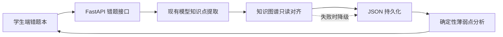

# 错题本集成说明

## 目标与边界

错题本直接扩展现有 FastAPI、React 和课程知识图谱模块，不复制 Agent、检索、模型配置或图谱构建逻辑。当前项目仍是单教师、单学生 MVP；接口通过 `student_id` 做数据隔离，但这不等价于服务端身份认证。部署到多用户环境前必须接入可信登录态，并由服务端生成学生身份。

三类来源统一为：

- `ai_generated`：出题 Agent 生成。服务端根据 Agent 身份自动推断，客户端不能将 AI 题伪装成其他来源。
- `user_uploaded`：学生手动上传或从普通问答保存。
- `question_bank`：外部题库，必须同时提供 `question_bank_id`；当前没有题库 UI，也不依赖未来 UI 才能保存或展示。

## 数据流



错题记录保存在 `data/mistake_book.json`，分类保存在 `data/mistake_book_categories.json`。这两个运行时文件均被 Git 忽略。删除错题会随记录一起删除批注；删除分类会把该分类下错题迁回默认“未分类”。

## 兼容与迁移

存量错题在读取时转换为 `schema_version: 2.0`，不要求一次性离线迁移，也不覆盖原文件。缺失字段采用以下兼容默认值：

- 来源为 `user_uploaded`；
- 分类为 `uncategorized`；
- 单轮旧问答转换为 `messages`；
- 知识点、章节、前置知识和批注为空；
- 旧的 `related_mistake_context`、附件和时间字段继续保留。

新写入记录使用统一结构，包含内容与消息、来源、题库标识、分类、知识标签、课程位置、前置知识、批注、会话和知识库信息。API 继续返回旧客户端依赖的 `mistakes` 字段。

## 知识图谱对齐

对齐服务只调用现有 `KnowledgeBaseManager.graph()` 和 Chunk 元数据，不修改图谱构建核心：

1. 先按规范化名称做精确匹配；
2. 再以字符串相似度做近似匹配，阈值为 `0.72`；
3. 无法匹配时保留为 `custom` 标签，并标记 `needs_confirmation`；
4. 章节与小节优先取关联 Chunk 元数据；
5. 前置知识优先取图谱显式关系，缺失时以章节顺序给出低置信度候选。

图谱未构建、暂不可用或知识库不存在时，保存流程仍成功：标签退化为自定义标签，位置和前置知识为空，避免图谱故障阻断错题归档。

## 薄弱点分析

分析完全由已保存记录确定，便于测试和复现。对每个规范化知识点计算：

```text
score = 错题数 * 10 + max(错题数 - 1, 0) * 5 + max(来源种类数 - 1, 0) * 2
```

- `score >= 35`：严重；
- `20 <= score < 35`：中等；
- 其余：轻微；
- 总样本少于 3 道时返回数据不足提示，避免把偶发错误描述成稳定薄弱项。

学习顺序按“明确前置知识 → 当前薄弱点 → 关联章节复习 → 同类题巩固”生成，并附上证据数量、来源分布和置信度信息。

## 接口摘要

- `GET /api/mistakes`：错题、分类和分析聚合视图；支持来源、分类过滤。
- `POST /api/mistakes`：新增错题，服务端继续沿用现有错题去重规则。
- `PATCH|DELETE /api/mistakes/{mistake_id}`：编辑或删除错题。
- `GET /api/mistakes/analysis`：独立获取薄弱点与学习规划。
- `GET|POST /api/mistakes/categories`：读取或新建分类。
- `PATCH|DELETE /api/mistakes/categories/{category_id}`：重命名或删除分类。
- `POST /api/mistakes/{mistake_id}/annotations`：新增批注；`client_request_id` 用于网络重试时幂等去重。
- `PATCH|DELETE /api/mistakes/{mistake_id}/annotations/{annotation_id}`：编辑或删除批注。

所有写操作会校验内容长度和枚举；跨学生访问返回不存在。批注在 React 中作为普通文本渲染，不执行 HTML。

## 外部题库接入

未来题库只需调用现有新增接口，并传入：

```json
{
  "student_id": "student-001",
  "source": "question_bank",
  "question_bank_id": "bank-question-42",
  "question": "题干",
  "answer": "学生答案"
}
```

因此即使题库管理页面尚未完成，数据结构、筛选、展示和分析已经支持该来源。

## 部署与回滚

部署前备份 `data/mistake_book*.json`，再更新代码并重启后端；读取时兼容迁移无需单独脚本。回滚代码不会主动重写旧记录，但旧版本不会识别新增字段和独立分类文件。若需要完整回滚，应同时恢复部署前的数据备份。

API Key 仅通过环境变量或请求时的受控配置注入，不写入错题、日志、前端源码或版本库。
